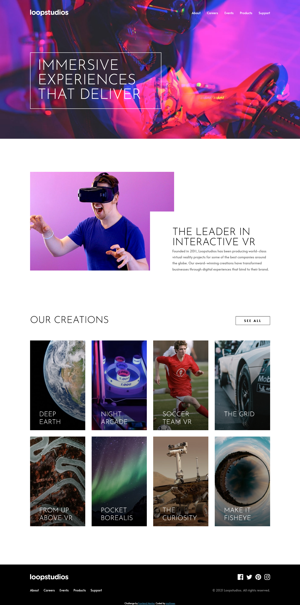

# Frontend Mentor - Loopstudios landing page solution

This is a solution to the [Loopstudios landing page challenge on Frontend Mentor](https://www.frontendmentor.io/challenges/loopstudios-landing-page-N88J5Onjw). Frontend Mentor challenges help you improve your coding skills by building realistic projects. 

## Table of contents

- [Overview](#overview)
  - [The challenge](#the-challenge)
  - [Screenshot](#screenshot)
  - [Links](#links)
- [My process](#my-process)
  - [Built with](#built-with)
  - [What I learned](#what-i-learned)
- [Author](#author)

## Overview

### The challenge

Users should be able to:

- View the optimal layout for the site depending on their device's screen size
- See hover states for all interactive elements on the page

### Screenshot

### Links

- Live Site URL: [Live on Vercel](https://loopstudios-landing-page-frontend-mentor-dpwao62ay-mattreee.vercel.app/)

## My process

### Built with

- Semantic HTML5 markup
- Flexbox
- CSS Grid
- [React](https://reactjs.org/) - JS library
- [SASS](https://sass-lang.com/)

### What I learned

This project was the first I tried using React composition. Personally, I liked how the App component divided everything at the end. It helped me extracting components and make the code cleaner. Finding what element I was looking for, was easier.

This was also the first time I used Sass' @each rule and maps effectively.

To the future, I pretend to look more into Hooks. All I needed in this project, was solved with useState and I can't help but think I should use something else, especially for the burger menu.

## Author

- Frontend Mentor - [mattreee](https://www.frontendmentor.io/profile/mattreee)
- CodePen - [asdjkl123](https://codepen.io/asdjkl123)
